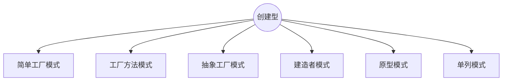
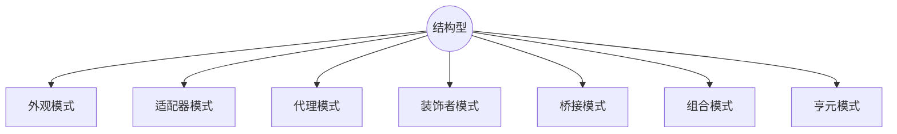
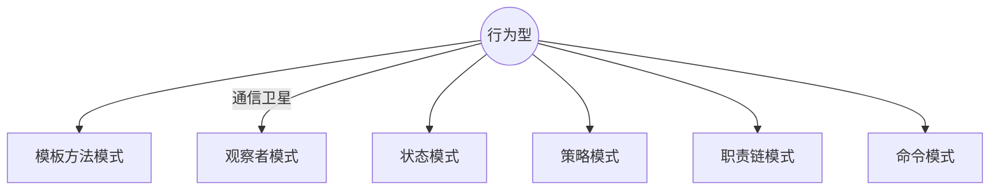
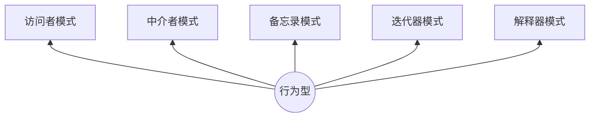
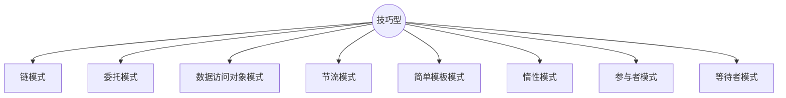
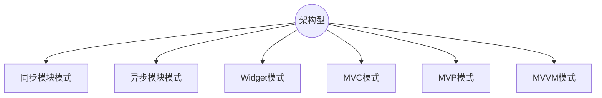

#  JavaScript Design Pattern

### 创建型模式

```mermaid
graph TB

A((创建型))
	A --> a1[简单工厂模式]
	A --> a2[工厂方法模式]
	A --> a6[抽象工厂模式]
	A --> a3[建造者模式]
	A --> a4[原型模式]
	A --> a5[单列模式]
```

### 结构型模式

```mermaid
graph TB
B((结构型))
	B --> b1[外观模式]
	B --> b2[适配器模式]
	B --> b3[代理模式]
	B --> b4[装饰者模式]
	B --> b5[桥接模式]
	B --> b6[组合模式]
	B --> b7[亨元模式]
```

### 行为型模式

```mermaid
graph TB
C((行为型))
	C --> c1[模板方法模式]
	C -- 通信卫星 --> c2[观察者模式]
	C --> c3[状态模式]
	C --> c4[策略模式]
	C --> c5[职责链模式]
	C --> c6[命令模式]
```

```mermaid
graph BT
C((行为型))
	C --> c7[访问者模式]
	C --> c8[中介者模式]
	C --> c9[备忘录模式]
	C --> c10[迭代器模式]
	C --> c11[解释器模式]
```

### **技巧型模式**

```mermaid
graph TB
D((技巧型))
	D --> d1[链模式]
	D --> d2[委托模式]
	D --> d3[数据访问对象模式]
	D --> d4[节流模式]
	D --> d5[简单模板模式]
	D --> d6[惰性模式]
	D --> d7[参与者模式]
	D --> d[等待者模式]
```

### 架构型模式

```mermaid
graph TB
E((架构型))
	E --> e1[同步模块模式]
	E --> e2[异步模块模式]
	E --> e3[Widget模式]
	E --> e4[MVC模式]
	E --> e5[MVP模式]
	E --> e6[MVVM模式]
```

